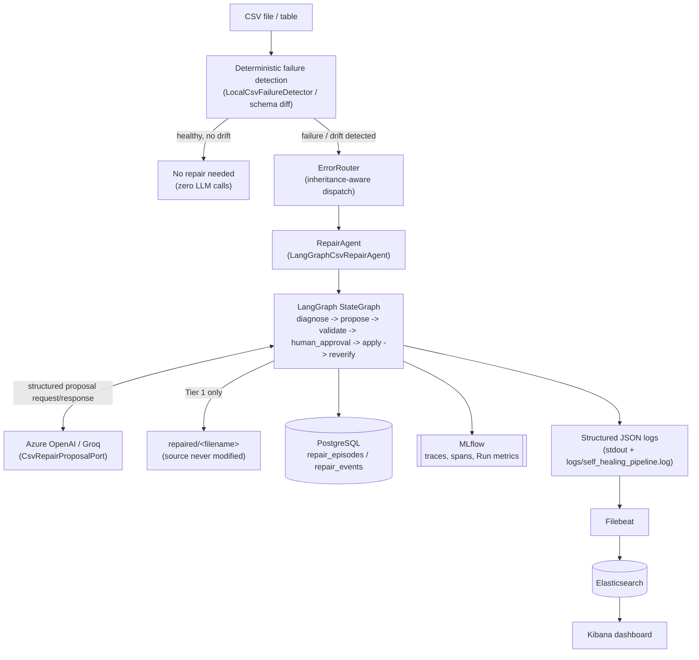
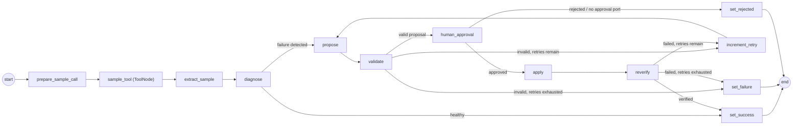
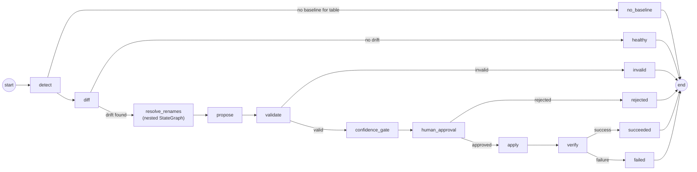
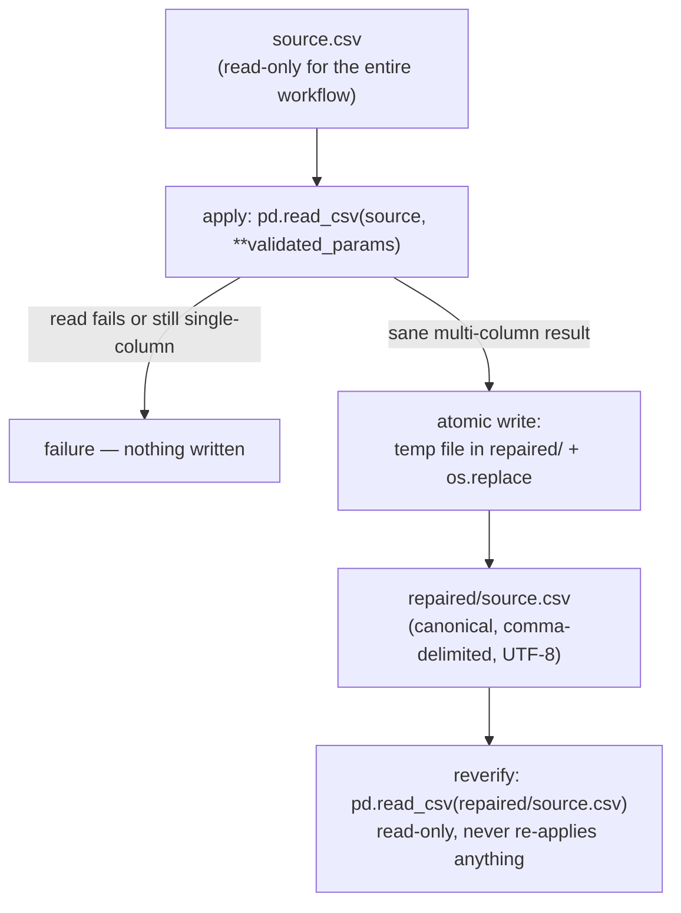
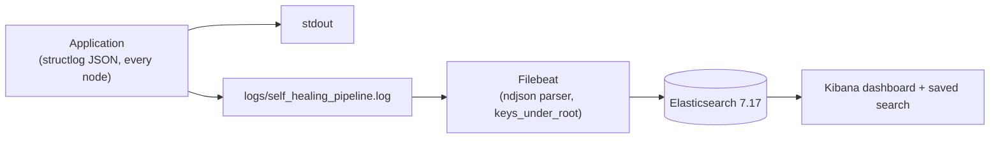

# Self-Healing Data Pipeline

## 1. Executive Summary

This repository implements a self-healing data pipeline that detects and
repairs two classes of structural data-quality failure — malformed CSV
files (**Tier 1**) and schema drift between a table's current structure
and a source-controlled baseline (**Tier 2**) — using deterministic
detection, an LLM that *proposes* (but never applies) a fix, Pydantic
validation of that proposal, and mandatory human approval before any
repair is applied. Every decision is recorded in PostgreSQL and/or an
append-only JSON history, every workflow invocation is traced in MLflow,
and every structured log line is searchable in Elasticsearch/Kibana.

The system is built on LangGraph `StateGraph` orchestration, Azure
OpenAI (with Groq as a verified alternate provider) for the one task
that genuinely requires judgment, and a hexagonal/clean architecture
that keeps the domain layer free of any infrastructure dependency.

## 2. Problem Statement

Conventional data pipelines fail *silently or expensively* at structural
boundaries: a CSV arrives with the wrong delimiter, an unexpected
encoding, or a header that isn't where the parser expects it, and the
ingestion job either crashes or — worse — parses garbage without
complaint. Upstream schema changes (a renamed column, a retyped column,
a dropped column) have the same failure shape one layer up. Today this
is normally caught by a human noticing a downstream anomaly, tracing it
back, and hand-writing a fix — slow, inconsistent, and hard to audit.

Pure deterministic automation (regex heuristics, fixed delimiter lists)
handles a narrow band of these failures and breaks the moment a new
variant appears. Pure LLM automation is the opposite failure mode:
non-deterministic, unauditable in isolation, and not something that
should be trusted to silently mutate real data. This project's position
is that **deterministic logic should own every fact that can be
established deterministically** (detection, diffing, encoding detection,
execution order), and **the LLM should be confined to the one step that
is genuinely a judgment call** (what parameters most plausibly explain
this specific malformed file; is this rename hint actually a rename) —
with every LLM output structurally validated and gated behind human
approval before it can touch anything. This division of responsibility
is documented as an explicit decision in
[ADR 0004](docs/architecture/adr/0004-provider-agnostic-llm-deterministic-execution.md).

## 3. Goals and Non-Goals

**Goals**
- Deterministically detect a fixed set of Tier 1 CSV failures and Tier 2
  schema-drift categories, with zero LLM involvement in the detection
  step itself.
- Use an LLM only to propose repair parameters/confirm ambiguous renames,
  never to execute a repair directly.
- Structurally validate every LLM output (Pydantic) before it can reach
  an execution step.
- Require explicit human approval before any repair that would modify
  data — no confidence threshold bypasses this.
- Make every repair attempt (applied or rejected) fully auditable:
  PostgreSQL for Tier 1/Tier 2 events, append-only JSON for Tier 2
  migration history, MLflow for LLM/workflow tracing, Elasticsearch/
  Kibana for operational log search.
- Never modify a Tier 1 source file — repairs are written to a separate
  output.

**Non-goals (this phase)**
- No Tier 3 or Tier 4 capability of any kind — no code for either exists
  in this repository (see §4).
- No Databricks or Azure Data Factory integration — both are reserved,
  commented-out `.env` placeholders with zero code reading them (see §4,
  §17).
- No production-grade security hardening (secrets rotation, RBAC,
  network policy) — this is a local-development/demo-grade deployment
  (see §23).
- No horizontal scaling, queueing, or multi-tenant execution — the CLI
  processes one file/table per invocation, synchronously.
- No UI or API-based approval channel — approval is a CLI prompt today
  (the approval ports are already framework-agnostic `Protocol`s so this
  can be added without touching either workflow; see §26).

## 4. Current Implementation Status

| Capability | Status |
|---|---|
| Tier 1 — CSV self-healing | **Implemented** |
| Tier 1 `single_column_malformation` repair | **PARTIALLY IMPLEMENTED** — single-character delimiters (including `" "`/`"\t"`) are repairable; variable-width whitespace is a confirmed **KNOWN LIMITATION** (fails safely, no regex-separator support — see §9, §25) |
| Tier 2 — Schema-drift self-healing | **Implemented** (one drift episode per invocation; Tier 2 multi-error is not implemented) |
| Tier 3 | **Not implemented** — no code exists in this repository |
| Tier 4 | **Not implemented** — no code exists in this repository |
| Azure OpenAI provider | **Implemented and verified** against a real Azure OpenAI deployment (real HTTP 200 response, real MLflow `CHAT_MODEL` span, real PostgreSQL audit record) |
| Groq provider | **Implemented and verified** — used as the alternate/dev provider throughout this project's history |
| Human approval gate | **Implemented** for every non-healthy repair, both tiers — no auto-apply path exists |
| Tier 1 source-file immutability | **Implemented** — source is read-only; repair is written to `repaired/<filename>` |
| Tier 2 file mutation | **Implemented** — mutates the target file directly, in place, after approval (no separate output file; see §12 for why this differs from Tier 1) |
| PostgreSQL repair audit | **Implemented** |
| MLflow tracing | **Implemented** |
| Structured JSON logging | **Implemented** |
| Elasticsearch/Kibana log search | **Implemented** |
| Databricks integration | **Not integrated** — reserved `.env` variables only (`DATABRICKS_HOST`/`_TOKEN`/`_CLUSTER_ID`, commented out), zero code references them |
| Azure Data Factory (ADF) integration | **Not integrated** — reserved `.env` variables only (`ADF_RUN_ID`/`_FACTORY_NAME`, commented out), zero code references them |
| CI/CD pipeline | **Not implemented** — no CI configuration exists in this repository |
| UI/API approval channel | **Not implemented** — CLI prompt only; the approval ports are Protocol-based specifically to make this addable later |

## 5. Architecture

Clean/hexagonal architecture (`domain` → `application` → `infrastructure`
→ `interfaces`), dependency inversion throughout: the domain layer knows
nothing about pandas, LangGraph, MLflow, PostgreSQL, Click, or any LLM
provider — everything infrastructure-specific is injected via
`typing.Protocol` ports, wired together in one composition root
(`src/self_healing_pipeline/interfaces/cli/main.py`).



Both tiers are independent, separately-compiled LangGraph `StateGraph`
workflows sharing the same architectural pattern (deterministic nodes →
one LLM-proposal node → Pydantic validation → human approval → apply →
independent reverify) but with no shared workflow code — see §7/§8 for
each graph's exact nodes and edges.

## 6. End-to-End Execution Flow

1. The CLI (`repair` or `schema-repair`) receives a file path (and, for
   Tier 2, a table name).
2. Detection runs first and is 100% deterministic — for Tier 1 this
   happens *before* the LangGraph workflow is even invoked
   (`LocalCsvFailureDetector.detect()` in `interfaces/cli/main.py`); for
   Tier 2 it's the workflow's own `detect`/`diff` nodes.
3. If nothing is wrong, the CLI/workflow short-circuits immediately —
   **no LLM call, no audit episode, no MLflow run** is created.
4. Otherwise, `ErrorRouter` (Tier 1) resolves the failure to
   `LangGraphCsvRepairAgent` via inheritance-aware MRO dispatch.
5. The graph deterministically samples the file (a real LangGraph
   `ToolNode`, `sample_csv_file`) and re-diagnoses (authoritative,
   independent of what the caller believed).
6. The LLM is invoked exactly once per attempt, only at the `propose`
   node, to produce repair parameters (Tier 1) or confirm a rename
   candidate (Tier 2) — never anywhere else in either graph.
7. The raw LLM response is validated with Pydantic
   (`CsvRepairParams`/`SchemaRepairOperation`); an invalid proposal never
   reaches `apply` — the graph retries (Tier 1, bounded) or terminates.
8. `human_approval` is reached for **every** non-healthy repair in both
   tiers — there is no confidence or failure-count threshold that
   bypasses it.
9. On approval, `apply` executes the validated, and only the validated,
   prescription — Tier 1 writes a separate `repaired/<filename>` output;
   Tier 2 mutates the target file in place.
10. `reverify`/`verify` independently re-reads the result (never the
    original prescription) to confirm the repair actually holds.
11. The episode's outcome (`succeeded`/`failed`/`rejected`) is recorded
    in PostgreSQL (Tier 1) or PostgreSQL + append-only JSON (Tier 2);
    the whole invocation is traced in MLflow; every node emits a
    structured JSON log line correlated by `trace_id`.

## 7. Tier 1 — CSV Self-Healing

**Graph**: `src/self_healing_pipeline/application/orchestration/csv_repair_workflow.py`



- **Supported failure modes**: `wrong_delimiter`, `wrong_encoding`,
  `header_detection`, `engine_selection`, `single_column_malformation`
  (`domain/value_objects/failure_class.py::FailureClass`) — a single
  file can be tagged with more than one simultaneously
  (`detect_all()`); the `propose` node then builds one combined
  evidence prompt so the LLM proposes a single prescription addressing
  every detected dimension at once.
- **`ToolNode`**: `sample_tool` wraps a real LangChain `@tool`
  (`sample_csv_file`) — deterministic, encoding-aware sampling of the
  first few lines, invoked through the graph's own tool-calling
  mechanism (not a plain function call), so it is a genuine node in
  MLflow's trace.
- **Conditional retry/fail routing**: `_route_after_validation` and
  `_route_after_verification` both check `retry_count < max_retries`
  before looping back to `propose` via `increment_retry`; exhausting the
  budget routes to `set_failure` instead.
- **Human approval**: `human_approval` is reached for every non-healthy
  repair — single-failure or multi-failure — before `apply`. Omitting an
  `approval_port` fails safe (treated as rejection, never silent
  auto-apply). See §11, §13, and
  [ADR 0003](docs/architecture/adr/0003-human-in-the-loop-approval.md).
- **Pydantic validation**: `CsvRepairParams` (`delimiter`, `encoding`,
  `header_row`, `engine`) — a proposal that fails validation never
  reaches `apply`.
- **Source immutability / repaired output location**: `apply`
  (`PandasCsvRepairExecutor.execute`) never opens the source file for
  writing. On success it atomically writes a new file at
  `<source directory>/repaired/<source filename>` (temp-file +
  `os.replace`, so a failed write can never corrupt anything) and
  reports that path as `output_path`. If the computed output path would
  ever resolve to the same path as the source, the repair fails safely
  instead of writing anything. See §12 for the full flow.
- **Re-verification**: `reverify` independently re-reads the *repaired
  output* file (never the source, never re-applies anything) with
  pandas' plain defaults and confirms it is still a sane, multi-column
  CSV.

## 8. Tier 2 — Schema Self-Healing

**Graph**: `src/self_healing_pipeline/application/orchestration/schema_repair_workflow.py`



- **Baselines**: versioned, source-controlled JSON per table
  (`configs/schema_baselines/<table>.json`) via `JsonSchemaBaselineStore`.
- **`ColumnDiff`**: fully deterministic
  (`application/orchestration/schema_diff.py::compute_column_diff`) —
  added/removed/type-changed columns, plus rename *hints* from stdlib
  `difflib` name-similarity. The LLM never computes the raw diff.
- **Rename detection**: `resolve_renames` is a genuinely separate,
  independently compiled `StateGraph`
  (`rename_resolution_subgraph.py`, `fuzzy_match -> llm_confirm ->
  confidence_score`) invoked as a single node of the parent graph — not
  simulated with a function call; MLflow's own trace shows its internal
  nodes nested under the parent.
- **Added/removed/type-changed columns**: all three are detected by
  `compute_column_diff` and represented as `SchemaRepairOperation`
  values (`OperationType.ADD_DEFAULT`/`DROP`/`CAST`).
- **Repair ordering**: operations are always normalized into
  `rename -> cast -> drop -> add_default`
  (`normalize_operation_order`), regardless of the order they were
  proposed/assembled in — enforced by code, never by the LLM.
- **Confidence**: `confidence_gate` computes and logs a real confidence
  score (blend of fuzzy-match similarity and the LLM's rename
  confirmation) and flags below-threshold proposals as `escalated` for
  extra visibility — but this only affects *logging*; approval is
  required either way, at any confidence level.
- **Migration/audit history**: every attempt (applied or rejected) is an
  append-only entry in `configs/schema_migrations/<episode_id>/*.json`
  (`JsonMigrationHistoryStore`, authoritative for Tier 2), mirrored
  best-effort into PostgreSQL (`schema_migration_events`,
  `PostgresSchemaMigrationStore`).
- **Episode continuity**: re-running with the same `--episode-id` loads
  prior history in `detect`, and a previously-rejected operation is
  never re-proposed in that episode.
- **Incomplete/out of scope**: Tier 2 has no retry loop (unlike Tier 1 —
  an invalid proposal routes straight to the `invalid` terminal state,
  not a bounded retry), and Tier 2 multi-error (multiple simultaneous
  drift episodes in one invocation) is not implemented.

## 9. Failure Modes

| Failure | Detection | Repair | LLM required? | Escalation |
|---|---|---|---|---|
| `wrong_delimiter` | `LocalCsvFailureDetector` (stdlib `csv.Sniffer`) | `CsvRepairParams.delimiter` correction, applied to a separate output file | Yes — LLM proposes the delimiter | Retry (bounded) → `set_failure` if unresolved |
| `wrong_encoding` | `LocalCsvFailureDetector` + `chardet` | `chardet`-corrected `encoding` field (deterministically overrides the LLM's guess for this one field only) | Yes for the rest of the prescription; encoding itself is deterministic | Retry (bounded) → `set_failure` |
| `header_detection` | `LocalCsvFailureDetector` (stdlib `csv.Sniffer`) | `header_row` correction | Yes | Retry (bounded) → `set_failure` |
| `engine_selection` | `LocalCsvFailureDetector` | `engine` correction (`python`/`c`/`pyarrow`); only the *missing-field* ragged-row variant is repairable — the *extra-field* variant has no representable fix in `CsvRepairParams` | Yes | Retry (bounded) → `set_failure` |
| `single_column_malformation` (consistent single-character separator, e.g. colon) | `LocalCsvFailureDetector` | `delimiter` correction — **IMPLEMENTED**, including whitespace delimiters (`" "`, `"\t"`) | Yes | Retry (bounded) → `set_failure` |
| `single_column_malformation` (variable-width whitespace, e.g. columns visually aligned with a run of spaces) | `LocalCsvFailureDetector` (same detection as above — the detector does not distinguish the two) | **KNOWN LIMITATION — not repairable.** See the dedicated note below the table. | Yes (LLM still proposes a delimiter; it's a valid single character, but cannot fix this specific data shape) | Fails safely: `apply` reports failure, `reverify` never touches any file, retries exhaust, `set_failure` — source is never modified |
| Multiple simultaneous Tier 1 failures | `detect_all()` → `frozenset[FailureClass]` | One combined prescription from one evidence-augmented LLM call | Yes | Same retry/fail path; always routed through `human_approval` |
| Added column (schema drift) | `compute_column_diff` | `add_default` operation | Yes — LLM confirms/contributes to the operation set via `propose` | No retry loop — `invalid` state on validation failure |
| Removed column (schema drift) | `compute_column_diff` | `drop` operation | Yes | Same |
| Type-changed column (schema drift) | `compute_column_diff` | `cast` operation | Yes | Same |
| Renamed column (schema drift) | `compute_column_diff` hint + `resolve_renames` subgraph | `rename` operation, only if `llm_confirm` + fuzzy-score confidence resolves the hint | Yes (subgraph's `llm_confirm` node) | Unconfirmed hints are not applied; a low-confidence but confirmed rename is still gated by `human_approval` |
| Genuine 3-way Tier 1 failure (encoding + delimiter + a structural class) | Not achievable | — | — | **Not supported** — `csv.Sniffer` cannot confidently report a delimiter under the same raggedness that would also trigger a structural failure; documented in `local_csv_failure_detector.py`'s module docstring |
| Multiple simultaneous Tier 2 drift episodes | Not implemented | — | — | **Not supported this phase** |

**`single_column_malformation` and variable-width whitespace — KNOWN LIMITATION, confirmed by live E2E validation with the real Azure OpenAI provider.**
`single_column_malformation` detection itself is fully **IMPLEMENTED** —
`LocalCsvFailureDetector` correctly flags any file where every row parses
as one field. Repair is **IMPLEMENTED** for the general case: a
single-character delimiter (any character, including whitespace — `" "`
and `"\t"` are both valid and accepted by `CsvRepairParams`). However,
`CsvRepairParams.delimiter` is, by design, a **single character**
(`min_length=1, max_length=1` — this is intentional and is not being
expanded; see §26). The canonical single-column-malformation fixture
used throughout this project's tests —
```
id  name    value
1   alpha   10
2  beta     20
3    gamma  30
```
— is separated by a **variable number of literal space characters** for
visual alignment (confirmed byte-for-byte: it contains no tab
characters at all), not a single consistent delimiter. No single
character can express "collapse a variable run of whitespace into one
delimiter" — that requires a regex separator (e.g. `sep=r"\s+"`), which
is **NOT currently supported** and is **not being added** (see §26 —
doing so would mean widening `CsvRepairParams` beyond its intentional
single-character model, an architectural change out of scope here).
Confirmed live: Azure OpenAI correctly proposes `delimiter: "\t"` for
this fixture (a reasonable, valid single-character guess), the proposal
passes validation, but `apply` still reports failure
(`"...the result still has a single column..."`) because there are no
literal tab bytes in the file to split on. **This fails safely** — no
output is ever created, `reverify` never touches any file, and the
source is left byte-for-byte unchanged (verified via SHA-256 before/
after in live testing) — rather than silently producing an incorrect
repair.

## 10. LLM Architecture

**Where Azure OpenAI/Groq is called**: exactly one place per graph —
Tier 1's `propose` node (`_make_propose_node` in
`csv_repair_workflow.py`) and Tier 2's `propose` node
(`schema_repair_workflow.py`) plus the `resolve_renames` subgraph's
`llm_confirm` node. Nowhere else in either graph makes a model call.

**Why there and not elsewhere**: every other node is either a pure
function over already-known data (`diagnose`, `diff`, `validate`,
`confidence_gate`, `apply`, `reverify`/`verify`) or a deterministic tool
call (`sample_tool`). `propose`/`llm_confirm` are the only steps where
the "correct" answer isn't computable from the input alone — *what
delimiter most plausibly explains this file's raggedness* and *is this
name-similarity hint actually the same column renamed* both require
judgment a fixed rule can't reliably encode.

**Prompt construction**: `AzureOpenAIProposalProvider`/
`GroqProposalProvider` (`infrastructure/llm/`) build a system + user
message pair from the failure class and the deterministically-sampled
file text (`sample_csv_file`); for `WRONG_ENCODING` and multi-failure
episodes, a deterministic evidence line (`chardet`'s result, or the full
list of detected failures) is prepended to the sample so the model has
the same facts a human would. The prompt never contains anything the
system doesn't already know deterministically — the LLM is not asked to
detect the problem, only to propose parameters given it.

**Structured output**: both providers request `response_format:
{"type": "json_object"}` and parse the response as a plain
`dict[str, Any]` — the raw payload is stored (`state["proposed_params"]`)
but never trusted as-is.

**Pydantic validation**: `CsvRepairParams`/`SchemaRepairOperation`
(`extra="forbid"`, `frozen=True`) is the *only* thing that turns a raw
dict into something `apply` is allowed to use. Both provider
implementations follow the same defensive contract: on any parse
failure, HTTP error, or malformed response, they return an empty/
rejecting dict rather than raising — so a broken LLM call degrades to
"invalid proposal," not an application crash.

**What happens when LLM output is invalid**: the `validate` node's
Pydantic construction fails, `state["validated_params"]` stays `None`,
and the graph routes to `increment_retry` (Tier 1, bounded by
`max_retries`) or straight to the `invalid` terminal state (Tier 2) —
**`apply` is structurally unreachable without a validated params
object**; there is no code path from an unvalidated proposal to a
filesystem write.

**How hallucinated parameters are prevented from being applied**: three
independent layers, not one — (1) Pydantic's structural validation
(wrong type, missing field, extra field, out-of-range value all reject
outright), (2) deterministic post-correction for the one field that's
directly recoverable from the file's own bytes (`WRONG_ENCODING`'s
`encoding`, via `chardet`, applied *after* the LLM responds so a wrong
LLM guess can never survive), and (3) mandatory human approval — even a
structurally valid, high-confidence proposal cannot reach `apply`
without an explicit "y".

## 11. Safety Model

| Mechanism | What it guards against |
|---|---|
| Human approval (`human_approval` node, both tiers) | An LLM-authored change being applied without a human decision — no confidence/failure-count threshold bypasses this |
| Pydantic validation (`CsvRepairParams`/`SchemaRepairOperation`) | A structurally malformed or hallucinated proposal reaching `apply` |
| Deterministic validation (`csv.Sniffer`, `chardet`, `compute_column_diff`) | The LLM being asked to determine facts that are directly recoverable from the data itself |
| Confidence gating (Tier 2 `confidence_gate`) | Low-confidence renames being applied *silently* — flagged `escalated`, but still gated by the same approval step as everything else |
| Source immutability (Tier 1) | The original file being lost or corrupted by a failed or wrong repair attempt |
| Independent re-verification (`reverify`/`verify`) | A repair being reported successful because "no exception was raised," rather than because the result was actually re-checked |
| Bounded retry (Tier 1 only) | An unresolvable proposal looping the graph indefinitely |
| Fail-safe on missing approval port | A future refactor silently reintroducing auto-apply — omitting `approval_port` is treated as rejection, not as "no gate configured" |
| Full audit trail (PostgreSQL + JSON) | Any repair attempt, applied or rejected, being unrecoverable/unexplainable after the fact |

## 12. Data and File Semantics

**Tier 1 is source-immutable.** The flow, exactly as implemented
(`infrastructure/csv/pandas_csv_repair_executor.py`):



The source file is **never opened for writing** anywhere in
`PandasCsvRepairExecutor` — a rejected repair, a failed write, and a
successful repair all leave it byte-for-byte identical. If the computed
output path would ever equal the source path, `execute()` refuses to
write anything and reports failure (`_refuse_if_output_collides_with_source`)
— this is a defense-in-depth check, not something reachable through
normal filename/directory combinations.

**Tier 2 is not source-immutable.** `PandasSchemaExecutor.execute`
(`infrastructure/schema/pandas_schema_executor.py`) reads the target
file, applies the approved operations in memory, and writes the result
back to the **same path** (`frame.to_csv(file_path, ...)`) — there is no
separate output file for Tier 2. This is a real, current asymmetry
between the two tiers, not an oversight in this documentation: Tier 1's
immutability guarantee was added specifically in response to a
production-realistic concern (approving a repair shouldn't destroy the
original ingested file); the same change has not (yet) been made for
Tier 2. See §25.

Both tiers share the upstream guarantee that matters most: **nothing is
written to any file until `human_approval` returns `True`.**

## 13. PostgreSQL Audit

**Tier 1** — `repair_episodes` / `repair_events`
(`infrastructure/persistence/postgres/schema.py`,
`PostgresRepairAuditStore`), always authoritative for Tier 1:

```sql
CREATE TABLE repair_episodes (
    episode_id UUID PRIMARY KEY,
    source TEXT NOT NULL,
    table_name TEXT,
    file_path TEXT,
    failure_class TEXT NOT NULL,
    status TEXT NOT NULL,
    started_at TIMESTAMPTZ NOT NULL,
    last_active_at TIMESTAMPTZ NOT NULL,
    completed_at TIMESTAMPTZ,
    is_active BOOLEAN NOT NULL DEFAULT TRUE,
    agent_last_used TEXT
);

CREATE TABLE repair_events (
    event_id UUID PRIMARY KEY,
    episode_id UUID NOT NULL REFERENCES repair_episodes(episode_id),
    node TEXT, status TEXT, error_type TEXT NOT NULL,
    handler_used TEXT, applied BOOLEAN NOT NULL DEFAULT FALSE,
    confidence DOUBLE PRECISION, diff TEXT,
    prescription JSONB, payload JSONB,
    latency_ms INTEGER, token_usage INTEGER, cost NUMERIC,
    mlflow_run_id TEXT, created_at TIMESTAMPTZ NOT NULL
);
```

`payload` (JSONB) carries per-node structured context, including
`source_path`/`output_path` on the `apply`/`reverify` events — the
audit record never claims the source was rewritten; it records exactly
what happened (a separate output was created, or nothing was written).

**Tier 2** — `schema_migration_events`
(`infrastructure/persistence/postgres/schema_migration_schema.py`,
`PostgresSchemaMigrationStore`), a **best-effort mirror**; the
source-controlled JSON migration history remains authoritative for
Tier 2.

**Lifecycle**: an episode is created at the first node of a non-healthy
attempt and marked `is_active = FALSE` with a `completed_at` timestamp
once the graph reaches a terminal state; every node along the way
appends one `repair_events` row (never mutated afterward — append-only).
A healthy file creates no episode at all — there is nothing to audit.

**Why PostgreSQL**: a relational, queryable, durable store for the
audit-of-record — the one place a reviewer can ask "what happened to
this file/table, in what order, with what outcome" without needing
MLflow or the filesystem.

**Audit guarantees**: every non-healthy repair attempt, applied or
rejected, produces at least one episode row and one event row per node
reached; rejection and failure are recorded with the same fidelity as
success (full prescription, confidence, and message retained).

## 14. MLflow Observability

- **Tracking server**: self-hosted (`docker/mlflow.Dockerfile`,
  `docker-compose.yml`'s `mlflow` service), backed by the same
  PostgreSQL instance as the audit store (a separate database schema
  entirely — the audit tables and MLflow's own backend-store tables
  never share rows).
- **Experiment**: `MLFLOW_EXPERIMENT_NAME` (`.env`).
- **Trace**: `MlflowRepairTraceTracer` wraps each `graph.invoke()` call
  in one outer trace (`repair_invocation`); `mlflow.langchain.autolog()`
  + `mlflow.openai.autolog()` (enabled once, `tracing_setup.py`)
  auto-instrument the rest — zero custom span-creation code.
- **Node-level spans**: every LangGraph node (`diagnose`, `propose`,
  `validate`, `human_approval`, `apply`, `reverify`, …) appears as its
  own nested `CHAIN` span, verified directly against real traces
  (18 spans for a typical Tier 1 run, including the nested `TOOL` span
  for `sample_csv_file`).
- **LLM spans**: every raw model call is a `CHAT_MODEL` span with real
  prompt/response and (from the SDK's own `usage` object) real token
  counts.
- **What's recorded**: `mlflow.chat.tokenUsage`/`mlflow.llm.cost` per
  `CHAT_MODEL` span (`infrastructure/mlflow/trace_llm_usage.py` sums
  these — cost is simply omitted if MLflow has no pricing entry for the
  model, never fabricated); Tier 1 additionally logs the aggregate as
  real MLflow Run metrics (`input_tokens`/`output_tokens`/`total_tokens`/
  `cost_usd`); Tier 2 stores the same aggregate on the migration history
  entry (`SchemaMigrationEntry.token_usage`).

**MLflow vs. PostgreSQL — do not conflate them**:

| | PostgreSQL | MLflow |
|---|---|---|
| Role | Repair audit / system of record | LLM & workflow execution tracing |
| Authoritative for | Tier 1 always; Tier 2 is a best-effort mirror | Nothing — it is observability *on top of* the audit trail |
| Survives a tracking-server outage? | Yes — audit writes are independent of MLflow | N/A — a failed MLflow write never blocks or fails a repair (best-effort, wrapped) |
| Answers | "What happened to this episode?" | "What did the LLM see and return, and how long did each step take?" |

## 15. Logging and Elasticsearch/Kibana



`infrastructure/logging/logger.py` writes structured JSON to **both**
stdout and the log file — unmodified by the observability work. Filebeat
tails the file and ships it to Elasticsearch; **Logstash is not used** —
Filebeat's native `ndjson` parser decodes each already-JSON line
directly. Two of the application's own field names collide with
Filebeat/ECS reserved fields and are renamed on ingest only
(`docker/filebeat/filebeat.yml`): `event` → `app_event`, `agent` →
`app_agent`. The on-disk log format itself is untouched.

**Kibana objects are version-controlled**, not created ad hoc:
`docker/kibana/saved_objects.ndjson` (a real Kibana `_export`, not
hand-written) is imported deterministically by
`scripts/provision_kibana.py` (stdlib-only, idempotent,
`overwrite=true`) — an index pattern, three visualizations, a dashboard,
and a "Repair episode trace explorer" saved search.

**Elasticsearch/Kibana vs. MLflow — different responsibilities**:
Elasticsearch/Kibana is responsible for **centralized operational log
search/filtering/dashboards** over the application's own log lines
(`trace_id`, `node`, `failure_class`, `level`, …). It does not carry
prompts, responses, spans, or token/cost data — those fields are never
written to these logs and are intentionally absent from the Kibana
dashboard; that information lives exclusively in MLflow (§14).

## 16. Repository Structure

```
src/self_healing_pipeline/
├── domain/                 # entities, value objects, exceptions, Protocol ports — zero infra imports
│   ├── entities/            RepairEpisode, RepairEvent, SchemaDefinition, SchemaMigrationEntry
│   ├── value_objects/        CsvRepairParams, FailureClass, RepairResult, ColumnDiff, SchemaRepairOperation, ...
│   ├── exceptions/           PipelineError hierarchy (CsvErrors, ...)
│   └── interfaces/           agents/repositories/services Protocols (CsvRepairExecutor, HumanApprovalPort, ...)
├── application/
│   └── orchestration/        csv_repair_workflow.py, schema_repair_workflow.py, rename_resolution_subgraph.py,
│                              error_router.py, schema_diff.py, audited_csv_repair.py, audited_schema_repair.py
├── infrastructure/           concrete adapters for every domain Protocol
│   ├── csv/                  LocalCsvFailureDetector, PandasCsvRepairExecutor
│   ├── schema/                PandasSchemaExecutor, PandasSchemaInspector, Json/Postgres migration stores
│   ├── llm/                   Azure OpenAI + Groq proposal/rename-confirmation providers, factories
│   ├── mlflow/                 tracing_setup, MlflowRepairTraceTracer, MlflowRepairRunTracker, trace_llm_usage
│   ├── persistence/postgres/  repair_audit_store.py, schema DDL
│   ├── logging/                structlog JSON configuration
│   ├── config/                 pydantic-settings (settings.py)
│   └── agents/                 LangGraphCsvRepairAgent (production), csv_repair_agent.py (legacy, test-covered)
└── interfaces/cli/           main.py — the composition root; click_*_human_approval.py

tests/
├── unit/                    application/, domain/, infrastructure/, interfaces/ — one file per behavior area
└── integration/              test_mlflow_tracing_smoke.py — real MLflow server required, auto-skips if unreachable

configs/
├── schema_baselines/         versioned Tier 2 baselines (customers_added.json, ...)
└── schema_migrations/        runtime-generated Tier 2 migration history (gitignored per-episode content)

docker/
├── mlflow.Dockerfile         self-hosted MLflow Tracking Server image
├── filebeat/filebeat.yml     log-shipping configuration
└── kibana/saved_objects.ndjson  version-controlled dashboard/index-pattern/saved search

scripts/
├── init_db.py                one-time Tier 1 Postgres schema init
├── provision_kibana.py        idempotent Kibana saved-object import
└── measure_nfr.py             NFR measurement harness (expensive — not part of routine test runs)

docs/architecture/adr/        0003 (human approval), 0004 (provider-agnostic LLM), 0005 (source immutability)
```

The repository was recently cleaned of 82 zero-byte, zero-reference
scaffold files from an earlier project-generation pass (a parallel,
never-developed generic "anomaly/pipeline healing" skeleton — FastAPI
app, SQLAlchemy models, Spark processor, a separate Elasticsearch
client, Alembic migrations) — none of it is reflected above because none
of it was ever real. The tree above is the actual, current
implementation.

## 17. Configuration

Copy `.env.example` to `.env`. **`.env` is gitignored — never commit
it.** Key variables:

| Variable | Purpose |
|---|---|
| `LLM_PROVIDER` | `azure_openai` or `groq` — both fully implemented and verified |
| `AZURE_OPENAI_API_KEY`/`_ENDPOINT`/`_API_VERSION`/`_DEPLOYMENT_NAME` | Azure OpenAI credentials |
| `GROQ_API_KEY`/`GROQ_MODEL` | Groq credentials |
| `DATABASE_URL`, `DB_HOST`/`_PORT`/`_NAME`/`_USER`/`_PASSWORD` | PostgreSQL connection (host app uses `localhost`; the MLflow *container* uses the `postgres` Compose service name internally) |
| `MLFLOW_TRACKING_URI`, `MLFLOW_EXPERIMENT_NAME` | MLflow |
| `LOG_LEVEL`, `LOG_FORMAT` | Structured logging |
| `ELASTICSEARCH_PORT`, `KIBANA_PORT` | Optional Compose port overrides — not read by the application itself |
| `DATABRICKS_HOST`/`_TOKEN`/`_CLUSTER_ID` | **Reserved, commented out — no code reads these** |
| `ADF_RUN_ID`/`_FACTORY_NAME` | **Reserved, commented out — no code reads these** |

Configuration is 100% environment-variable driven via `pydantic-settings`
(`infrastructure/config/settings.py`, one `BaseSettings` class per
concern, aggregated into `Settings`) — there is no YAML/JSON
configuration file read anywhere in the application.

## 18. Local Setup

```bash
python -m venv .venv && source .venv/bin/activate
pip install -r requirements-dev.txt
cp .env.example .env                 # fill in real values — never commit .env
docker compose up -d                 # PostgreSQL, self-hosted MLflow, Elasticsearch, Kibana, Filebeat
docker compose ps                    # all five should report healthy
PYTHONPATH=src python scripts/init_db.py            # one-time: create repair_episodes/repair_events
PYTHONPATH=src python scripts/provision_kibana.py   # idempotent: recreate the Kibana dashboard/saved search
```
MLflow UI: http://localhost:5000 · PostgreSQL: `localhost:5432` (see
`.env.example`) · Elasticsearch: http://localhost:9200 · Kibana:
http://localhost:5601.

(Tier 2's PostgreSQL mirror table, `schema_migration_events`,
self-initializes on first use — `PostgresSchemaMigrationStore` calls its
own `initialize_schema_migration_schema`; no separate script step is
needed for it.)

## 19. Running the Pipeline

```bash
# Tier 1
PYTHONPATH=src python -m self_healing_pipeline.interfaces.cli.main repair /path/to/file.csv

# Tier 2
PYTHONPATH=src python -m self_healing_pipeline.interfaces.cli.main schema-repair <table> /path/to/file.csv [--episode-id <uuid>]
```
Both are verified against `src/self_healing_pipeline/interfaces/cli/main.py`.
`repair` prints `failure_class`, `success`, `applied`, `source_path`,
`output_path` (when a repair was written), `prescription`, and
`message`, and exits non-zero on an unsuccessful outcome. `schema-repair`
prints `episode_id`, `table`, `status`, `confidence`, `human_approved`,
`prescription`, and `message`.

### Running via the application container (optional)

The commands above run the CLI directly on the host — this project's
primary, most-exercised path. A production-oriented `Dockerfile` (repo
root) is also available, packaging the same `src/` application via
`PYTHONPATH=/app/src` (this project's `pyproject.toml` has no
`[project]`/`[build-system]` table, so there is no `pip install .` step
here either — the image reproduces the exact host convention).
**Deliberately not added as a `docker-compose.yml` service** —
PostgreSQL/MLflow/Elasticsearch/Kibana/Filebeat there are
infrastructure this application connects *to*, not services that should
start alongside it by default; adding a sixth service wasn't needed to
validate the image and risks changing the existing five's behavior for
no benefit.

```bash
docker build -t self-healing-pipeline-app .

# Top-level help — genuinely needs zero configuration, no secrets.
docker run --rm self-healing-pipeline-app

# A real repair, reachable over the same network docker-compose already
# created (verified working: `docker network ls` → selfhealingdatapipeline_default;
# the app container reaches `postgres`/`mlflow` by Compose service name,
# exactly like the mlflow container already does internally — see
# docker-compose.yml's own top comment for why).
docker run --rm \
  --network selfhealingdatapipeline_default \
  -e LOG_LEVEL=INFO -e LOG_FORMAT=json \
  -e LLM_PROVIDER=groq -e GROQ_API_KEY=<your-key> -e GROQ_MODEL=<your-model> \
  -e DB_HOST=postgres -e DB_PORT=5432 \
  -e MLFLOW_TRACKING_URI=http://mlflow:5000 \
  -v /path/to/data:/data \
  self-healing-pipeline-app repair /data/file.csv
```
No secrets or `.env` file are ever baked into the image (see
`.dockerignore`) — every setting above is supplied at `docker run` time,
exactly as the host CLI already reads them from the environment. Runs
as a non-root user (`appuser`).

If this were added to `docker-compose.yml`, the shape would be (not
applied — reported per this task's scope):
```yaml
  app:
    build: .
    depends_on:
      postgres: { condition: service_healthy }
      mlflow: { condition: service_healthy }
    environment:
      DB_HOST: postgres
      MLFLOW_TRACKING_URI: http://mlflow:5000
      LLM_PROVIDER: ${LLM_PROVIDER}
      LOG_LEVEL: ${LOG_LEVEL:-INFO}
      LOG_FORMAT: ${LOG_FORMAT:-json}
    volumes:
      - ./data:/data
```
invoked with `docker compose run app repair /data/file.csv` (`run`, not
`up` — this is a one-shot CLI invocation, not a long-running service).

## 20. Testing

```bash
PYTHONPATH=src pytest -q
ruff check src/ tests/
ruff check scripts/
mypy --strict src/ tests/
```

Current verified result on this repository, this session:
**245 passed.**

- **Unit tests** (`tests/unit/`): one file per behavior area across
  `application/` (both workflows, error router, rename subgraph, schema
  diff), `domain/` (schema repair operations, `CsvRepairParams`), and
  `infrastructure/` (both LLM providers, both executors, MLflow
  tracker/tracer, Postgres audit store, tracing setup, token/cost
  aggregation) and `interfaces/` (CLI).
- **Integration tests** (`tests/integration/test_mlflow_tracing_smoke.py`):
  real MLflow server required — auto-**skips** (not fails) if
  unreachable at `http://localhost:5000`.
- **Healthy-path tests**: assert zero LLM calls, zero audit episode,
  zero MLflow run for a healthy file (both tiers).
- **Rejection tests**: assert `apply` is never called and the source
  is byte-for-byte unchanged when a human rejects a proposal.
- **Repair tests**: assert both tiers' apply/reverify behavior,
  including Tier 1's separate-output-file contract specifically
  (`test_pandas_csv_repair_executor.py`,
  `test_csv_repair_workflow.py`).
- **Observability tests**: MLflow run tracker/trace tracer, token/cost
  aggregation, tracing setup — all against real or faked MLflow calls,
  no network for the unit-level ones.

## 21. Demo Guide

**Demo 1 — Healthy file**
```bash
printf 'id,name,value\n1,alpha,10\n2,beta,20\n' > /tmp/healthy.csv
PYTHONPATH=src python -m self_healing_pipeline.interfaces.cli.main repair /tmp/healthy.csv
# -> "HEALTHY: ... already parses correctly." — zero LLM calls, zero audit episode, zero MLflow run
```

**Demo 2 — Wrong delimiter (full happy path)**
```bash
printf 'id;name;value\n1;alpha;10\n2;beta;20\n' > /tmp/f1.csv
PYTHONPATH=src python -m self_healing_pipeline.interfaces.cli.main repair /tmp/f1.csv
# approve with "y" at the prompt
# -> diagnose (wrong_delimiter) -> LLM proposal -> Pydantic validation -> approval
#    -> apply (writes /tmp/repaired/f1.csv) -> reverify -> audit + trace recorded
# /tmp/f1.csv itself is untouched; sha256sum before/after is identical
```

**Demo 3 — Rejected repair**
```bash
PYTHONPATH=src python -m self_healing_pipeline.interfaces.cli.main repair /tmp/f1.csv
# answer "n" at the approval prompt
# -> status: rejected; source remains untouched; no /tmp/repaired/f1.csv is created
```

**Demo 4 — Tier 2 schema drift** (implemented and verified)
```bash
printf 'id,name,age,country\n1,Alice,30,India\n' > /tmp/customers.csv
PYTHONPATH=src python -m self_healing_pipeline.interfaces.cli.main schema-repair customers_added /tmp/customers.csv
# baseline already exists at configs/schema_baselines/customers_added.json
```

### Inspecting results
- **Logs**: stdout, JSON lines — `grep trace_id` to follow one episode
  across every node.
- **PostgreSQL**: `docker exec self-healing-pipeline-postgres psql -U postgres -d self_healing_pipeline -c "SELECT * FROM repair_episodes ORDER BY started_at DESC LIMIT 5;"`
- **MLflow**: open http://localhost:5000, or `mlflow.get_trace(trace_id)`
  from the printed `trace_id`.
- **Schema migration history**: `configs/schema_migrations/<episode_id>/*.json`.

## 22. Observability Demo

To follow **one repair episode** across every system, run Demo 2 above
and note the printed `trace_id`, then:

1. **Terminal logs** — `grep '"trace_id": "<id>"' logs/self_healing_pipeline.log`
   shows every node's log line for that episode, in order.
2. **PostgreSQL** —
   `SELECT node, status, payload FROM repair_events WHERE episode_id = '<episode_id>' ORDER BY created_at;`
   shows the same sequence as the audit-of-record, including
   `source_path`/`output_path` on the `apply`/`reverify` rows.
3. **MLflow** — `http://localhost:5000`, open the run/trace printed by
   the CLI; the trace tree shows every node as a nested span, the real
   LLM prompt/response as a `CHAT_MODEL` span, and real token counts.
4. **Kibana** — `http://localhost:5601` → **Discover** → "Repair episode
   trace explorer" → filter by `trace_id`, or **Dashboard** →
   "Self-Healing Pipeline — Operational Log Dashboard" for aggregate
   repair volume / failure-class distribution / outcome breakdown.

## 23. Security

- **Secrets management**: all credentials come from `.env`
  (`python-dotenv` + `pydantic-settings`); `.env` is gitignored and was
  confirmed never tracked in this repository (`.env.example` contains
  placeholders only — verified, no real key patterns present).
- **No credentials in Git**: verified by scanning tracked files for
  common secret patterns (API-key prefixes, private-key headers) —
  none found.
- **LLM input considerations**: the LLM only ever receives a small,
  deterministically-sampled excerpt of the file plus deterministic
  evidence (chardet result, detected-failure list) — never the whole
  file, never credentials, never data from other episodes.
- **Filesystem safety**: Tier 1's `apply` uses atomic
  temp-file-then-`os.replace` writes and an explicit
  output-path-vs-source-path collision check (§12); a failed write
  never leaves a partial file behind.
- **Source-file preservation**: Tier 1 never opens the source for
  writing, at any point, in any code path (§12) — Tier 2 does not carry
  this guarantee (§12, §25).
- **Auditability**: every non-healthy repair attempt, applied or
  rejected, is durably recorded (§13) with the full prescription and
  confidence that were involved.
- **Least privilege**: **not currently modeled** — the application uses
  one PostgreSQL role with full DDL/DML rights on its own database, and
  local-dev Elasticsearch/Kibana run with security disabled (7.x
  default, appropriate only for local development). This repository
  does not implement production-grade access control; see §25.

## 24. Performance / Reliability

Historical, real (not invented) measurements exist in
[docs/NFR_RESULTS.md](docs/NFR_RESULTS.md), captured via
`scripts/measure_nfr.py` in an earlier session against the Groq
provider — healthy-path CLI overhead and end-to-end repair latency, with
explicit methodology and caveats (single machine, single run, not a
statistically rigorous benchmark suite). Those figures are **not**
re-measured in this documentation pass — re-running `measure_nfr.py` was
out of scope for a documentation-only task. Treat the numbers in that
file as historical evidence of order-of-magnitude behavior, not a
current SLA.

**Not yet measured**: Azure OpenAI latency/cost profile, MLflow tracing
overhead in isolation from process-startup cost, PostgreSQL write
latency under concurrent episodes, Elasticsearch/Filebeat ingestion
latency, and any multi-file/concurrent-invocation throughput — none of
these have a real measurement in this repository.

## 25. Known Limitations

- **Tier 2 does not preserve the source file** — `apply` mutates the
  target file in place; only Tier 1 writes to a separate output (§12).
  This is a genuine, current asymmetry, not a documentation gap.
- **Genuine 3-way simultaneous Tier 1 failure** (encoding + delimiter +
  a structural class) is architecturally unreachable with the current
  `csv.Sniffer`-based detector.
- **`ENGINE_SELECTION`'s "extra field" variant** (a ragged row with
  *more* fields than the header) has no representable fix in
  `CsvRepairParams` — a schema-shape limitation, not a bug; the
  "missing field" variant is genuinely repairable.
- **Tier 2 has no retry loop** — an invalid proposal terminates the
  episode as `invalid` rather than retrying (Tier 1 retries up to
  `max_retries`).
- **Tier 2 multi-error** (multiple simultaneous drift episodes) is not
  implemented — one table/baseline diff per invocation.
- **Tier 3 and Tier 4** do not exist in this repository in any form.
- **Databricks and ADF integration** do not exist — reserved,
  commented-out `.env` variables only.
- **No UI/API approval channel** — CLI prompt only.
- **No CI/CD pipeline** is configured in this repository.
- **A known, intermittent MLflow trace-tag race** can occasionally cause
  one integration test to fail under full-suite load (self-heals on
  rerun; already mitigated with bounded retries — see
  `mlflow_repair_trace_tracer.py`).
- **No production security hardening** — see §23.
- **No horizontal scaling / queueing** — one file/table per synchronous
  CLI invocation.
- **KNOWN LIMITATION — variable-width-whitespace `single_column_malformation`
  cannot be repaired.** `CsvRepairParams.delimiter` is intentionally a
  single character (not a regex separator); a run of variable-width
  spaces has no single-character representation. Confirmed via live E2E
  with the real Azure OpenAI provider: the proposal, validation, and
  approval steps all succeed, but `apply` correctly reports failure and
  the source is left untouched — see §9 for the full analysis. Regular,
  single-consistent-character `single_column_malformation` (including a
  tab or space delimiter) **is** repairable.
- **KNOWN LIMITATION — best-effort MLflow trace/artifact export can emit
  a non-fatal permission warning.** Observed at least once during Tier 2
  validation: `Failed to send trace to MLflow backend: [Errno 13]
  Permission denied: '/mlartifacts'`. Root cause: this project's MLflow
  Tracking Server is started with a bare local `--default-artifact-root
  /mlartifacts` (`docker-compose.yml`), so each experiment's
  `artifact_location` is recorded as that literal path — a path that
  only exists inside the MLflow container's own volume, not on the host
  where the CLI (and its MLflow client) actually runs. The client's
  best-effort artifact-export attempt fails as a result; **the trace's
  core metadata is still recorded successfully regardless** (confirmed:
  `mlflow.get_trace(...)` still returns the full span tree after this
  warning appears), matching this project's existing "MLflow is
  best-effort, never blocks or invalidates a repair" design (§14). Not
  fixed: `artifact_location` is fixed per-experiment at creation time,
  so changing the Compose command would not retroactively fix the
  experiment already in use throughout this project, and would need
  careful, separate verification before touching a working tracking
  server — out of scope for a stabilization pass under this project's
  "do not introduce unnecessary risk" constraint.
- **TEST-HARNESS ONLY — a piped single `y` cannot survive a retry's
  second approval prompt.** Investigated directly: `click.confirm()`
  raises `click.Abort` on stdin EOF — standard, correct Click behavior,
  identical to what happens if a real interactive user pressed Ctrl+D or
  Ctrl+C at *any* approval prompt (not specific to retries). A real user
  at an interactive terminal never encounters stdin EOF between prompts.
  Separately, and already documented in `audited_csv_repair.py`'s own
  module docstring prior to this investigation: because the audit
  episode is recorded *after* `graph.invoke()` returns (not per-node),
  an aborted invocation — from Ctrl+C or Ctrl+D, at any prompt, retry or
  not — produces no PostgreSQL episode row for that attempt. The source
  file is never at risk either way (confirmed: byte-for-byte unchanged
  after an aborted run). Recording partial/aborted attempts would
  require per-node incremental audit writes or a new terminal status —
  an architectural change intentionally not made here (see §26).

## 26. Roadmap

**Current implementation** — see §4.

**Next logical improvements** (natural extensions of what already
exists, not new architecture):
- Apply Tier 1's source-immutability pattern to Tier 2 (`apply` writes a
  separate output rather than mutating in place).
- Add a bounded retry loop to Tier 2, mirroring Tier 1's.
- Tier 2 multi-error support (multiple simultaneous drift episodes).
- Point the MLflow server's `--default-artifact-root` at a proxied
  `mlflow-artifacts://` URI (a Compose/infrastructure-only change) to
  eliminate the best-effort artifact-permission warning documented in
  §25 for any *newly created* experiment — noting this would not
  retroactively affect the existing `tier1-csv-repair` experiment.
- Per-node (rather than post-invocation) audit persistence, so an
  interactively aborted CLI session still leaves a partial audit trail
  — see §25's TEST-HARNESS ONLY finding.

**Explicitly not on this roadmap** (considered during stabilization and
deliberately not pursued): regex/multi-character separators for
`single_column_malformation`'s variable-width-whitespace case (§9, §25)
— this would mean widening `CsvRepairParams` beyond its intentional
single-character delimiter model, which this project treats as a
deliberate design boundary, not an oversight.

**Future / optional** (deferred, not started, no code exists):
- A UI/API-based approval channel — the approval ports are already
  framework-agnostic `Protocol`s specifically so this requires zero
  workflow change.
- Tier 3/Tier 4 capabilities.
- Databricks/ADF integration.
- CI/CD pipeline.
- Production-grade security hardening (secrets rotation, least
  privilege, network policy).

## 27. Troubleshooting

| Symptom | Likely cause | Resolution |
|---|---|---|
| CLI hangs or errors connecting to Postgres | `postgres` container not healthy, or `.env` `DB_*` mismatched with `docker-compose.yml` | `docker compose ps` — confirm `healthy`; re-check `DB_HOST`/`DB_PORT` in `.env` match the published port |
| Repair succeeds but no MLflow trace/run appears | MLflow server unreachable, or `MLFLOW_TRACKING_URI` wrong | `docker compose ps` — confirm `mlflow` `healthy`; tracking failures are best-effort and never fail the repair itself, so check the CLI's own stdout for tracking-error payloads |
| `AzureOpenAIProposalProvider` returns an empty/rejecting proposal every time | Invalid `AZURE_OPENAI_*` credentials/endpoint/deployment name | Verify all four `AZURE_OPENAI_*` variables in `.env`; the provider never raises on a bad call, it returns `{}`, which then fails Pydantic validation and shows up as a retry/failure, not a crash |
| Docker services won't start / port conflicts | Another process already bound to `5432`/`5000`/`9200`/`5601` | Override the relevant `*_PORT` variable in `.env` (all five services read theirs from env with sane defaults) |
| Malformed/unreadable input file | Genuinely unsupported failure combination (§9), or a file the detector can't even sample | `repair` will report `HEALTHY` only if `LocalCsvFailureDetector.detect()` finds nothing; otherwise it routes through the normal repair flow and reports its own validation errors |
| Repair rejected — is the file safe? | Expected behavior — human answered anything other than `y`/`yes` | Yes: `apply` was never called; the source is provably byte-for-byte unchanged (asserted directly in tests, not just inferred) |
| `ModuleNotFoundError: self_healing_pipeline` | `PYTHONPATH=src` not set | Every command in this README that imports the package is prefixed `PYTHONPATH=src` — this is required, not optional, since the package isn't installed in editable mode |
| Missing/placeholder environment variables | `.env` not copied from `.env.example`, or a required field left as a placeholder | `cp .env.example .env` first; `pydantic-settings` will raise a validation error naming the exact missing/invalid field on startup |

## 28. License / Project Information

License: TBD (unchanged from the prior version of this document — no
license file exists in this repository).
